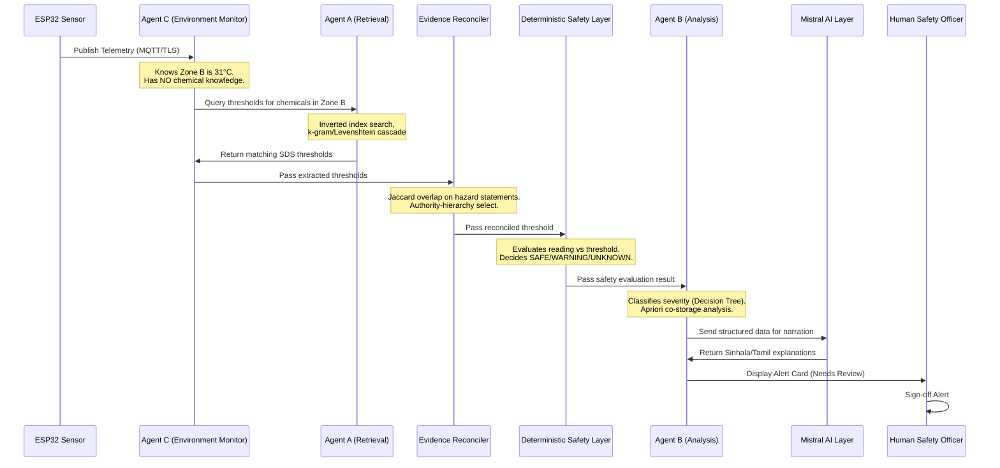

# ChemSentry — Complete Viva Preparation Document
### Course: IT3041 (Information Retrieval and Web Analytics)
### Domain: Chemical Engineering (Industrial Chemical Safety)

---

## 1. Domain Selection (3 Marks)

### 1.1. The Problem: The Chemical Storage Gap
In mid-sized industrial facilities (such as textile dyeing, rubber vulcanization, and agrochemical blending plants), managing chemical inventory safety is a significant risk. 
* **Static, Unread Safety Documentation:** Every chemical stored is accompanied by a manufacturer's **Safety Data Sheet (SDS)**. These are typically 10–20 page PDF documents containing crucial thresholds (e.g., maximum storage temperatures, compatibility rules, exposure limits). They sit unread in physical binders or digital directories.
* **Supplier Contradictions:** Different suppliers provide contradicting storage specifications for the exact same substance due to variations in grade, concentration, or regional regulations.
* **Operational Disconnect:** Physical environments (humidity, temperature, VOC leaks) are disconnected from safety documentation thresholds. Facilities rely on hardcoded limits or fail to track compliance dynamically.
* **Language Barriers:** SDSs are overwhelmingly published in English, whereas factory floor operators who handle the drums daily primarily speak and read **Sinhala** or **Tamil**.

### 1.2. Importance of the Domain
A single chemical storage failure can lead to catastrophic industrial incidents: toxic gas release (e.g., mixing acid with cyanide salts), fires (exceeding flashpoints), or explosions. Automating safety compliance directly impacts human lives, regulatory compliance, and environmental protection.

### 1.3. Target Users
* **Chemical Safety Officers / Supervisors:** Responsible for plant safety compliance, incident review, and signing off on alerts.
* **Floor Operators / Warehouse Staff:** Workers handling chemical drums on the factory floor, requiring instant, localized (Sinhala/Tamil) safety translations.
* **Factory Auditors / Management:** Need auditable proof of continuous environmental compliance.

### 1.4. Why Agentic AI is Suitable
Chemical storage environments are dynamic. The system must adapt to changing warehouse layouts, varying inventory, and noisy sensor feeds. A monolithic script with hardcoded logic would fail because:
1. **Delegation of Concerns:** A multi-agent system divides telemetry monitoring, document search, and semantic reasoning.
2. **Intent & Path Split:** The system handles structured sensor inputs deterministically, but when safety officers ask open-ended questions (e.g., *"Why did Zone B flag a warning last Tuesday?"*), the AI acts as an **orchestrator** that dynamically decides which tools to call (inverted index, historical incident database, Apriori rules) to build the response.
3. **Safety Isolation:** Agentic boundaries prevent non-deterministic language models (LLMs) from making critical safety verdicts, keeping them isolated to communication and translation roles.

---

## 2. Understanding of the Proposed System (4 Marks)

### 2.1. System Overview
**ChemSentry** is an evidence-grounded, retrieval-driven safety decision-support architecture. It connects real-time telemetry from physical sensors (like temperature, humidity, and gas concentration) with rules retrieved dynamically from authoritative, versioned SDS documentation.

```
       [ IoT Telemetry (MQTT) ]
                  │
                  ▼
      [ Deterministic Rule Retrieval ]  ◄── [ Raw SDS Corpus ]
                  │
                  ▼
       [ Evidence Reconciler ]  (Resolves supplier disagreements via Jaccard)
                  │
                  ▼
  [ Deterministic Safety State Machine ]  (No LLM: yields SAFE / WARNING / UNKNOWN)
                  │
                  ▼
       [ Natural Language Layer ]  (Mistral AI translations to Sinhala/Tamil)
                  │
                  ▼
        [ Human-in-the-Loop ]  (Mandatory Safety Officer sign-off)
```

### 2.2. Problem Solved
ChemSentry bridges the gap between digital safety documents and the physical environment. Instead of comparing temperature to a static hardcoded threshold (like `temp > 25°C`), the system **knows no safe thresholds at start**. It parses what chemicals are in the room, retrieves their specific thresholds from the indexed SDSs on the fly, reconciles any discrepancies, and compares them to active sensor values.

### 2.3. Key Functions
* **Telemetry Intake:** Consumes live physical sensor data (temperature, humidity, VOCs) over MQTT.
* **Tolerant IR Search:** Resolves typed queries with misspelled names (e.g., `"tolune"` $\rightarrow$ `"toluene"`) using k-grams, Levenshtein distance, and Soundex.
* **Information Extraction:** Parses messy SDS files to extract chemical names, CAS numbers, GHS hazard codes, and numeric thresholds using regex.
* **Evidence Reconciliation:** Employs Jaccard similarity to catch contradictions between supplier sheets and resolves them using a predefined authority hierarchy.
* **Deterministic Safety Evaluation:** Compares live telemetry against reconciled limits to output exactly three states: **SAFE**, **WARNING**, or **UNKNOWN**.
* **Co-storage Anomaly Discovery:** Runs the Apriori algorithm to discover frequent co-storage pairs and flags chemical incompatibilities using a CAMEO reactivity matrix lookup.
* **Language Translation:** Generates bilingual safety cards (Sinhala and Tamil) using Mistral AI for floor workers.

### 2.4. Value Proposition
* **Zero Hardcoded Thresholds:** Safety rules are always verified against source documents, preventing errors when chemical grades or configurations change.
* **Auditable Provenance:** Every alert contains a full citation (supplier name, version, SDS section, page number, and original text snippet).
* **Multilingual Safety:** Lowers language barriers on the shop floor, preventing accidents due to miscommunication.
* **Uncertainty Preservation:** By exposing an `UNKNOWN` state rather than guessing, it prevents dangerous false-positives and false-negatives.

---

## 3. Agents and Their Roles (4 Marks)

ChemSentry is designed with three specialized agents that communicate using the Model Context Protocol (MCP) and MQTT.



### 3.1. Agent C — Environmental Monitor (IoT Eyes)
* **Why Needed:** Telemetry collection must be decoupled from semantic processing to maintain low latency, resilience to network drops, and device abstraction.
* **Responsibilities:**
  * Subscribes to live sensor feeds over MQTT/TLS.
  * Monitors physical zones and maps them to active database-backed inventories.
  * Formulates context objects (Zone ID, Chemical list, telemetry reading) and initiates the safety query.
* **Hard Constraint:** Holds **zero chemical knowledge**. It knows Zone B is at $31\text{ °C}$ but has no idea if that is dangerous. It must ask the retrieval pipeline.

### 3.2. Agent A — Retrieval Agent (The Classical IR Brain)
* **Why Needed:** Resolving raw user or sensor queries to precise document passages requires classical information retrieval techniques rather than slow, non-deterministic LLM lookups.
* **Responsibilities:**
  * Tokenizes and preprocesses search queries.
  * Performs tolerant matching (resolving typographical errors or phonetic inputs).
  * Executes Boolean, wildcard, and positional index lookups to find relevant sections of SDSs.
  * Employs TF-IDF and Cosine similarity to rank matching document sections and returns provenanced thresholds.
* **Hard Constraint:** Never makes a safety verdict. It only returns document matches with high-integrity provenance.

### 3.3. Agent B — Analysis Agent (Semantic Reasoner & Classifier)
* **Why Needed:** Telemetry values must be interpreted in context (how severe is a breach?), inventory placement must be audited for incompatibilities, and alerts must be translated.
* **Responsibilities:**
  * Runs the **Evidence Reconciler** to identify supplier SDS contradictions.
  * Invokes the **Deterministic Safety Layer** (Safety State Machine) to evaluate physical safety states.
  * Runs a **Decision Tree Classifier** to classify breach severity into classes (`LOW`, `MEDIUM`, `HIGH`, `CRITICAL`).
  * Executes the **Apriori Algorithm** to analyze co-storage layout anomalies.
  * Interacts with the LLM layer (`SafetyCardNarrator`) to translate alerts into Sinhala and Tamil and generate natural explanations.

---

## 4. Implementation Plan (3 Marks)

### 4.1. Core Technical Components & Algorithms (Mapped to Labs)
Our architecture implements classical IR, machine learning, and association mining directly aligned with the course syllabus:

* **Information Retrieval (IR):**
  * *Inverted and Positional Index (Lab 03):* Hand-built inverted index for fast keyword matching, preserving word positions to support proximity searches.
  * *Tolerant Retrieval (Lab 04):* Implements k-grams (for wildcard matching like `*chlorate`), Levenshtein Edit Distance, and Soundex (phonetic spelling) to handle messy inputs.
  * *Vector Space Model (Lab 05):* Leverages TF-IDF vectorization and Cosine Similarity to rank SDS passages based on document relevance.
  * *Index Elimination (Lab 06A):* Prunes candidate lists during real-time retrieval to meet low-latency alerting requirements.
* **Natural Language Processing (NLP):**
  * *Preprocessing (Lab 02):* Lowercasing, tokenization, and stemming.
  * *Chemical Name Protection (Divergence):* Standard tokenizers and stemmers destroy chemical names (e.g., stripping dashes in `1,2-dichloroethane` or collapsing `chlorate` and `chloride` to the same stem). We implement **selective stemming** and **identifier protection** regex rules.
  * *Information Extraction (Lab 07):* Hand-coded regular expressions parse SDS PDFs into 16 standardized GHS sections, pulling out CAS numbers, Hazard codes (H-statements), and temperature ranges.
* **Machine Learning & Classification:**
  * *Hazard Severity Classification (Lab 08):* A scikit-learn `DecisionTreeClassifier` with `class_weight='balanced'` predicts incident severity levels (`LOW` to `CRITICAL`) using NFPA 704 ratings and GHS hazard counts.
* **Association Rule Mining:**
  * *Co-storage Mining (Lab 09):* Runs `mlxtend.apriori` over zone inventory transaction logs to find co-storage patterns. Discovered rules are cross-referenced with a CAMEO reactivity matrix to identify incompatible chemical pairings.

### 4.2. Security Architecture
* **IoT Edge Security:** MQTT clients utilize individual TLS certificates. Devices not matching the register are rejected.
* **Input Validation:** Sensor inputs undergo strict schema validation and range boundaries before triggering queries, preventing telemetry-based injection.
* **ReDoS Prevention:** Regular expressions in the extraction pipeline utilize bounded quantifiers to avoid catastrophic backtracking.
* **Role-Based Access Control (RBAC):** Gated endpoints (using FastAPI + JWT tokens) restrict operations. While any user can view safety cards, only authorized Safety Officers can sign off on alerts.

### 4.3. Agent Communication Protocol
* **MQTT:** Used for sensor telemetry (ESP32 $\rightarrow$ Agent C) to ensure lightweight, resilient pub-sub communication.
* **Model Context Protocol (MCP):** Powers agent-to-agent communication. It exposes Agent A and Agent B's internal functionalities as strictly typed tools.
* **REST APIs:** Exposes the gateway endpoints to the React-based frontend dashboard.

---

## 5. Responsible AI Plan (3 Marks)

Safety-critical systems require strict ethical and operational guardrails. We implement Responsible AI guidelines through architectural boundaries:

| Issue | ChemSentry Implementation |
|---|---|
| **Privacy & Security** | * Data minimization: IoT sensors only transmit physical values (e.g., temperature), not worker identity.<br/>* Role-based access (RBAC) prevents unauthorized visibility of plant inventory and layout.<br/>* Encryption at rest for inventory logs and append-only database records. |
| **Fairness** | * Equal performance across low-resource chemicals (those with fewer indexed sheets) by checking for minimum authority fallback thresholds.<br/>* Multilingual parity: Translating safety explanations to Sinhala and Tamil ensures safety metrics are accessible to floor workers, preventing discrimination based on language literacy. |
| **Transparency & Explainability** | * **No safety black-box:** Safety decisions are made by deterministic code, not an LLM. <br/>* **Full Provenance:** Every alert displays the exact source supplier, document revision date, page number, and original text snippet alongside the verdict. |
| **Handling Misuse** | * **Scope Bound:** The system only retrieves storage guidelines. System prompts and tool schemas prevent the LLM from suggesting chemical synthesis procedures, reactions, or formulations. |
| **Deterministic Isolation** | * The system operates with three strict safety states: `SAFE`, `WARNING`, and `UNKNOWN`. If documents are missing, conflicting, or corrupted, the system declines to guess and defaults to `UNKNOWN`, forcing human review. |

---

## 6. Commercialization Plan (3 Marks)

### 6.1. Target Market
Our target market is **Sri Lankan manufacturing SMEs (Small and Medium Enterprises)** with 20–200 employees operating in sectors such as:
1. Textile dyeing and finishing (handling acids, bleaches, mordants).
2. Rubber processing (vulcanizing agents, accelerants).
3. Agrochemical blending and packaging.
4. Food and beverage chemical storage.

**The Gap:** Enterprise Environmental Health and Safety (EHS) suites are too expensive, and generic monitoring systems rely on static hardcoded values. ChemSentry provides an affordable, retrieval-driven compliance layer.

### 6.2. Pricing and Revenue Model
We propose a Software-as-a-Service (SaaS) and on-premises licensing hybrid model:

| Tier | Price | Features Included |
|---|---|---|
| **Free Tier** | $0$ | Up to 25 chemical substances, single-user access, manual document reconciliation (no IoT integration). |
| **Standard Tier** | $49\text{ USD/month}$ | Up to 150 substances, 2 active monitoring zones, 5 users, and automatic Sinhala/Tamil translation card generation. |
| **Professional Tier** | $149\text{ USD/month}$ | Unlimited substances, 10 monitoring zones, historical incident search, and exportable compliance reports for safety audits. |
| **On-Premises / Self-Hosted** | $1,800\text{ USD/year}$ | Local deployment, private database, local offline translation models, and zero external network egress. |

### 6.3. Local Market Insight: On-Premises Tier
Many local manufacturers operate under export-client contracts (e.g., supplying global apparel brands) that enforce strict data privacy. These contracts often prohibit uploading operational data, warehouse inventories, or production telemetry to public cloud services. The **Self-Hosted tier** enables them to run ChemSentry entirely on a local server, maintaining compliance without violating confidentiality agreements.

### 6.4. Deployment Strategy
* **Cloud:** FastAPI gateway backed by PostgreSQL, running on AWS/Render.
* **On-Premises:** Packaged as Docker containers (via `docker-compose.yml`) deploying local database instances.
* **IoT Hardware:** Low-cost, easily sourced ESP32 microcontrollers and DHT22 temperature/humidity sensors, bringing implementation costs below $15,000\text{ LKR}$ per zone.

---

## 7. Crucial Viva Preparation Tips & Questions

### 7.1. Expected Panel Questions and "Foolproof" Answers

#### Q: "Why didn't you just use vector embeddings and a Vector DB for retrieval?"
* **Answer:** "Vector embeddings are non-deterministic, opaque, and prone to retrieval drift. For safety-critical chemical specs, we need absolute keyword accuracy (e.g. distinguishing `1,2-dichloroethane` from `1,1-dichloroethane`). Classical IR (inverted index, boolean models, and k-grams) gives us deterministic, token-level matching with transparent scores that are easily audited. Additionally, vector databases are not covered in the IT3041 syllabus, whereas this project serves as a direct, rigorous application of all classical IR labs (Inverted Indices, k-grams, TF-IDF Cosine similarity, Index Elimination)."

#### Q: "How does your system handle conflicting SDS data?"
* **Answer:** "Silently choosing one threshold is a safety hazard. We first detect GHS hazard conflicts using Jaccard Similarity on the extracted hazard code sets. If the Jaccard similarity is below $0.6$, we trigger an `UNKNOWN` safety state and request human review. For numeric thresholds, we check the authority weights of the suppliers. If equal-authority documents diverge by more than our tolerance ($5\%$), we do not guess; we flag a conflict, report the disagreement, and default to the `UNKNOWN / REVIEW REQUIRED` safety state."

#### Q: "Why do you have a multi-agent architecture instead of a single program?"
* **Answer:** "Because of the complete decoupling of concerns. Agent C represents the 'eyes' (sensor loops) and contains absolutely no chemical knowledge. Agent A is the 'search specialist' that queries the index but never decides safety. Agent B is the 'analyst' that applies deterministic rules, runs ML classification, and translates outputs. This isolation guarantees that a network lag in Agent C doesn't block the retrieval index of Agent A, and a non-deterministic LLM hallucination in Agent B can never corrupt the deterministic safety path."

#### Q: "What are your divergences from the lab code, and why did you make them?"
* **Answer:** 
  1. *Preprocessing (Lab 02):* The lab strips all punctuation and stems all terms. We had to protect chemical names (e.g., keeping hyphens in CAS numbers `78-93-3`) and use selective stemming so that `chlorate` and `chloride` do not collapse into the same word stem, which would be a severe safety error.
  2. *Tokenization (Lab 03):* The lab splits on whitespace. We implemented a chemical domain tokenizer to keep compound names like `2-butanone` intact rather than fragmenting them.
  3. *Jaccard Similarity (Lab 04/Lecture 11):* Web crawlers use Jaccard to detect and discard near-duplicate pages. We inverted this principle: we compute Jaccard similarity on hazard statement sets from different suppliers to *keep* and highlight the differences (contradictory hazards).
